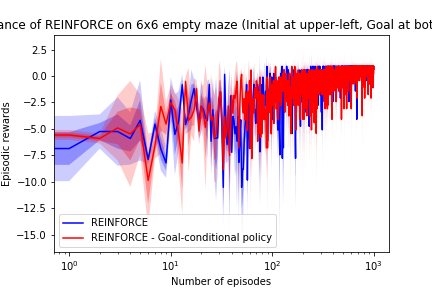

# lagom: A flexible framework in PyTorch for developing and benchmarking reinforcement learning algorithms. 

# TODO:
- A2C
- TRPO/PPO
- DDPG
- ACER
- Q-Prop
- ACKTR
- Rainbow

# Reference: 
This repo is inspired by TensorForce, OpenAI rllab, OpenAI baselines and Intel Coach