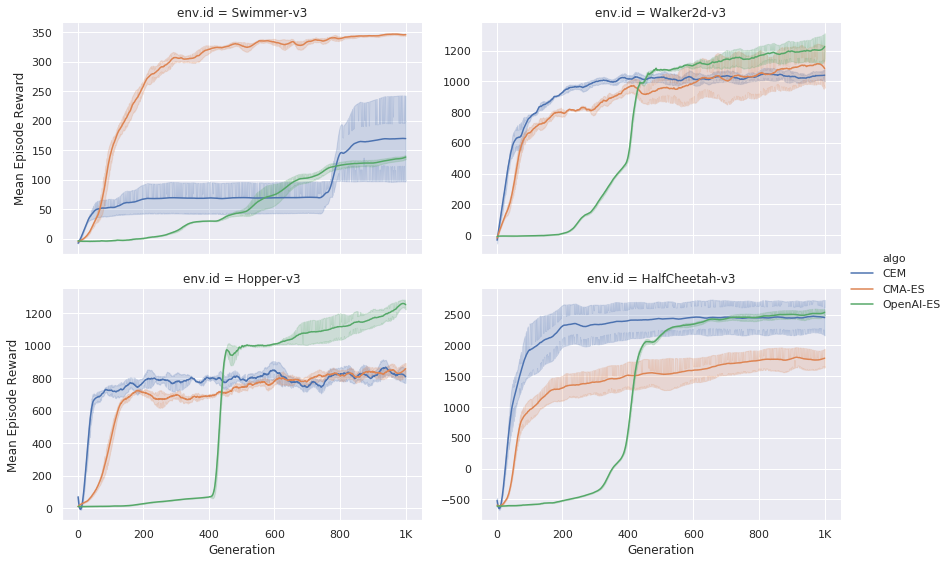
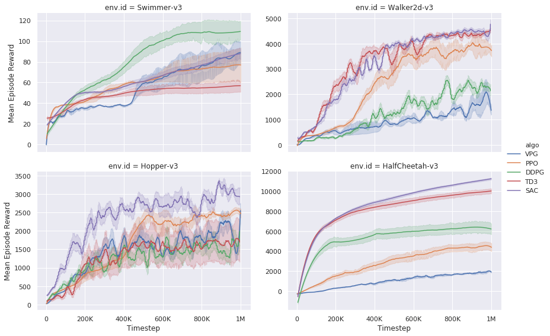

This example includes the implementations of the following reinforcement learning algorithms:

- ES
    - [Cross Entropy Method (CEM)](cem)
    - [Covariance Matrix Adaptation Evolution Strategy (CMA-ES)](cmaes)
    - [OpenAI-ES](openaies)
- RL
    - [Vanilla Policy Gradient (VPG)](vpg)
    - [Proximal Policy Optimization (PPO)](ppo)
    - [Deep Deterministic Policy Gradients (DDPG)](ddpg_td3)
    - [Twin Delayed DDPG (TD3)](ddpg_td3)
    - [Soft Actor-Critic (SAC)](sac)
    
# Download loggings for reproducibility
Because the loggings and checkpoint files are very large, putting them in the repo directly leads to inconveniently slow cloning, so we host the logging files in Dropbox. 
- [Download](https://www.dropbox.com/s/6xo3d3ipjcbdsi8/all_logs.tar.gz?dl=0) the file
- Put `all_logs.tar.gz` under the directory `lagom/baselines`
- Run `python unzip_logs.py`, this will automatically exact all `logs` folders under each algorithm folder. 

# Benchmarks

## ES


## RL


## FAQ:
- How to train with [dm_control](https://github.com/deepmind/dm_control) environments?
    - Modify `experiment.py`: use [dm2gym](https://github.com/zuoxingdong/dm2gym) wrapper, e.g.
    ```python
    from gym.wrappers import FlattenDictWrapper
    from dm_control import suite
    from dm2gym import DMControlEnv

    config = Config(
        ...
        'env.id': Grid([('cheetah', 'run'), ('hopper', 'hop'), ('walker', 'run'), ('fish', 'upright')]),
        ...
        )

    def make_env(config, seed):
        domain_name, task_name = config['env.id']
        env = suite.load(domain_name, task_name, environment_kwargs=dict(flat_observation=True))
        env = DMControlEnv(env)
        env = FlattenDictWrapper(env, ['observations'])
        ...
    ```
