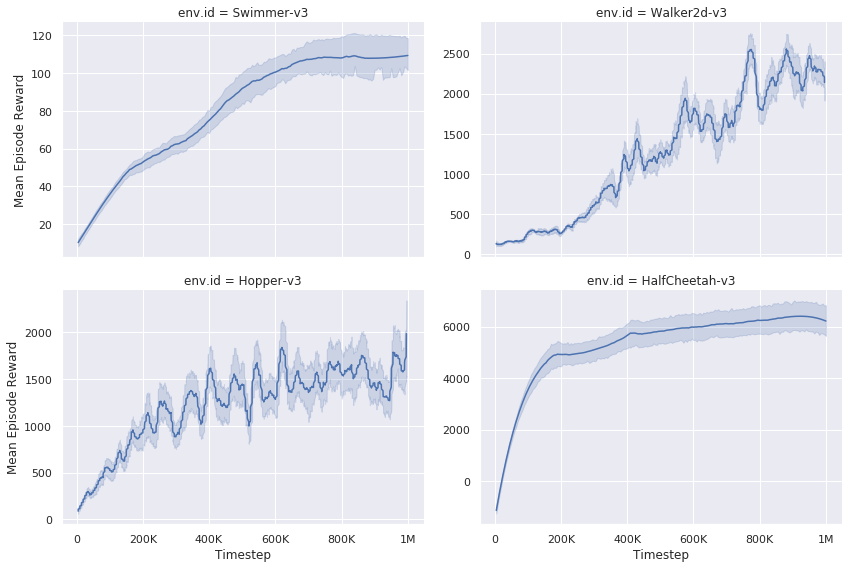

# Deep Deterministic Policy Gradients (DDPG)

This is an implementation of [DDPG](https://arxiv.org/abs/1509.02971)

# Usage

Run the following command to start parallelized training:

```bash
python experiment.py
```

One could modify [experiment.py](./experiment.py) to quickly set up different configurations. 

# Results

