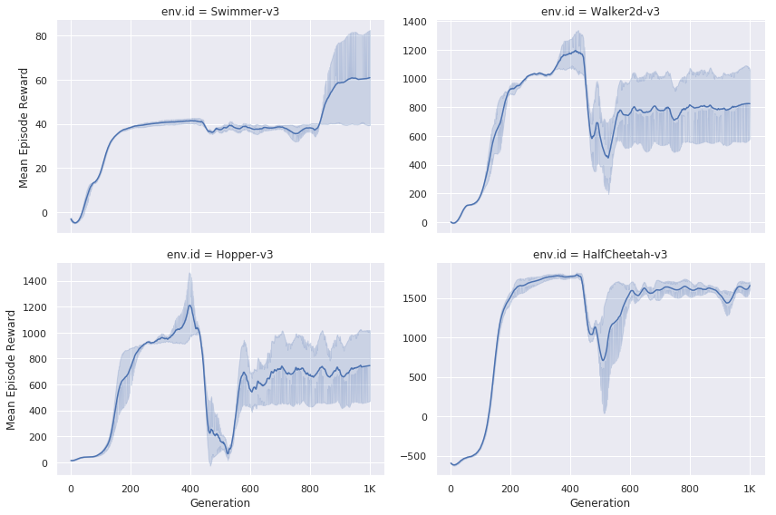

# OpenAI-ES

This is an implementation of [OpenAI-ES](https://arxiv.org/abs/1703.03864) algorithm. 

# Usage

Run the following command to start parallelized training:

```bash
python experiment.py
```

One could modify [experiment.py](./experiment.py) to quickly set up different configurations. 

# Results

## MLP policy

