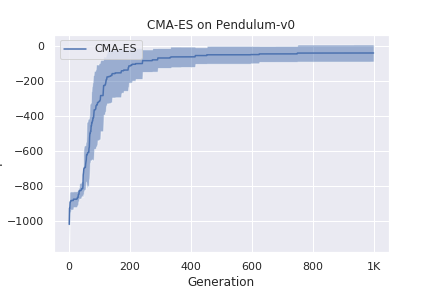

# Evolution Strategies (ES) in RL

This example shows how to build an ES algorithm to train an RL agent to solve OpenAI Gym environment. 

# Usage

Run the following command to start parallelized training:

```bash
python main.py
```

One could modify [experiment.py](./experiment.py) to quickly set up different configurations. 

# Results


