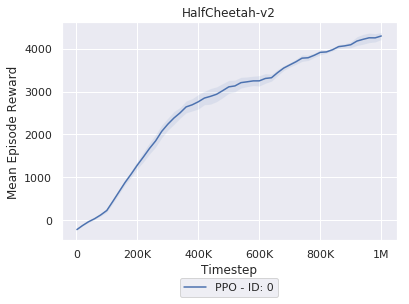

# Proximal policy optimization (PPO)

This is an implementation of [PPO](https://arxiv.org/abs/1707.06347) algorithm. 

# Usage

Run the following command to start parallelized training:

```bash
python main.py
```

One could modify [experiment.py](./experiment.py) to quickly set up different configurations. 

# Results




