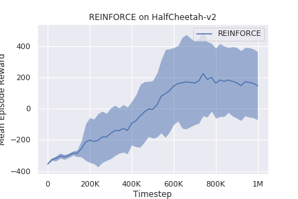

# REINFORCE

This is an implementation of [REINFORCE](https://link.springer.com/article/10.1007/BF00992696) algorithm. 

# Usage

Run the following command to start parallelized training:

```bash
python main.py
```

One could modify [experiment.py](./experiment.py) to quickly set up different configurations. 

# Results


