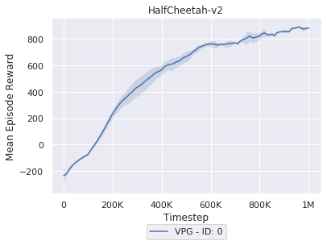
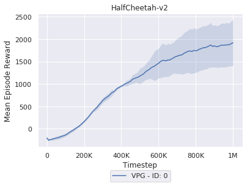

# Vanilla Policy Gradient (VPG)

This is an implementation of [VPG](http://rll.berkeley.edu/deeprlcoursesp17/docs/lec2.pdf) algorithm. 

# Usage

Run the following command to start parallelized training:

```bash
python experiment.py
```

One could modify [experiment.py](./experiment.py) to quickly set up different configurations. 

# Results

## MLP policy
MLP policy | LSTM policy
 --- | --- 
 | 
