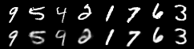
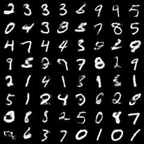

# VAE

This example implements Variational Auto-Encoders (VAE) from the paper [Stochastic Gradient VB and the Variational Auto-Encoder](http://arxiv.org/abs/1312.6114) with both MLP and CNN version. 

# Usage

Run the following command to start parallelized training:

```bash
python experiment.py
```

One could modify [experiment.py](./experiment.py) to quickly set up different configurations. 

# Results

VAE type | Reconstructed images | Sampled images
--- | --- | ---
**VAE** |  | 
**ConvVAE** |  | 
